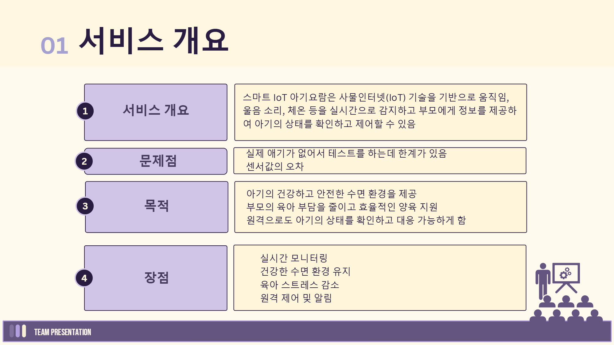
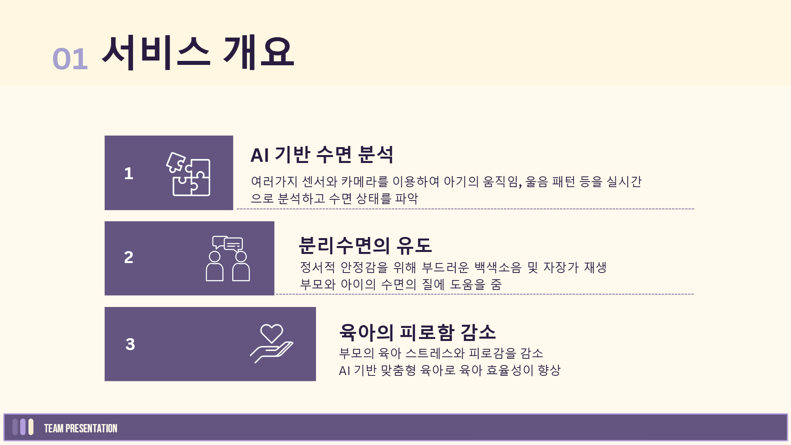
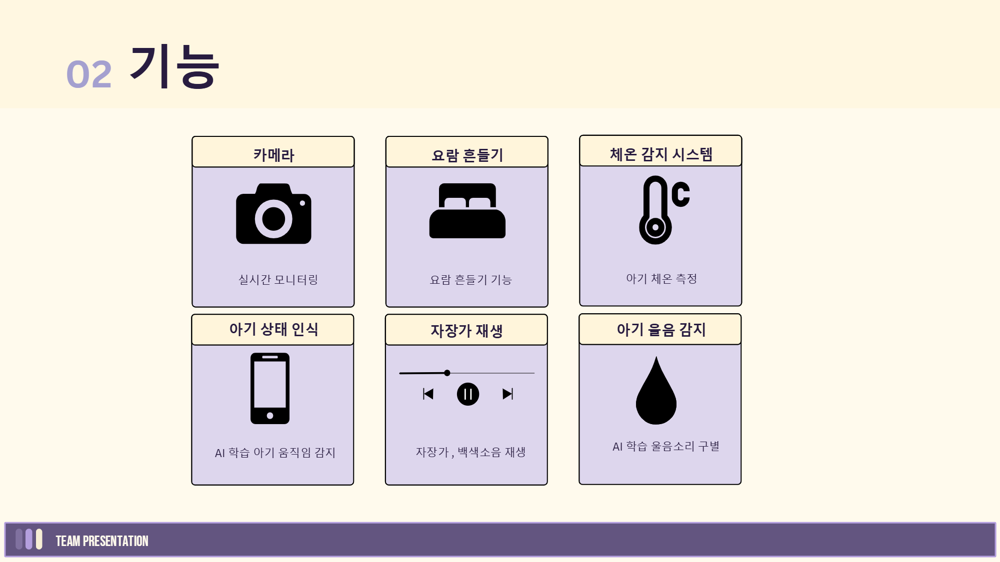
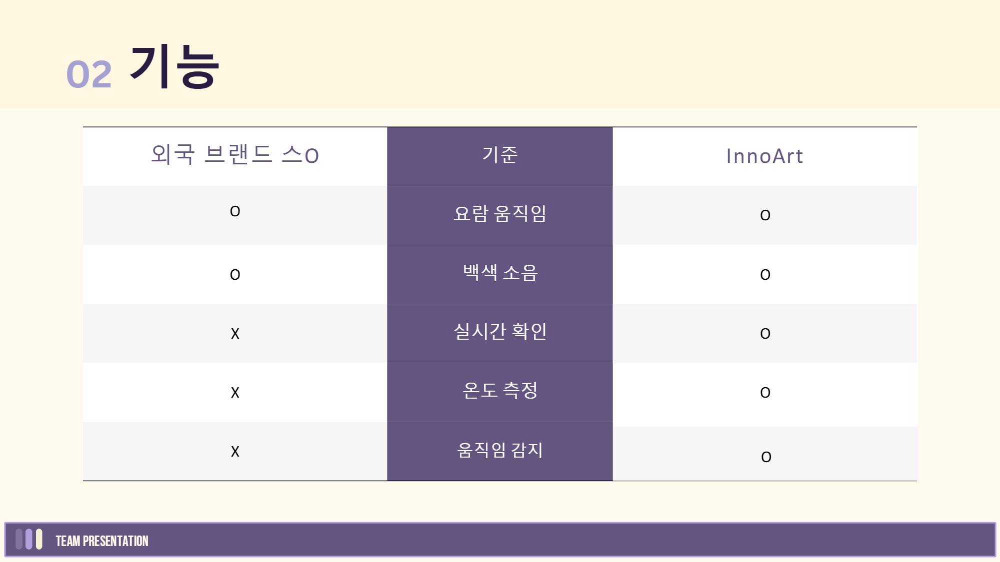
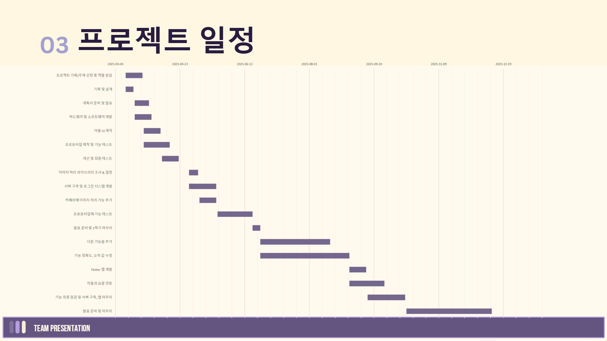
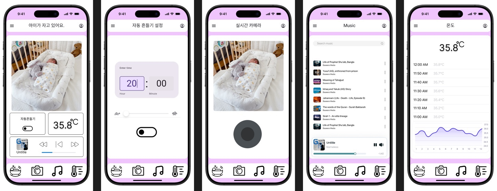
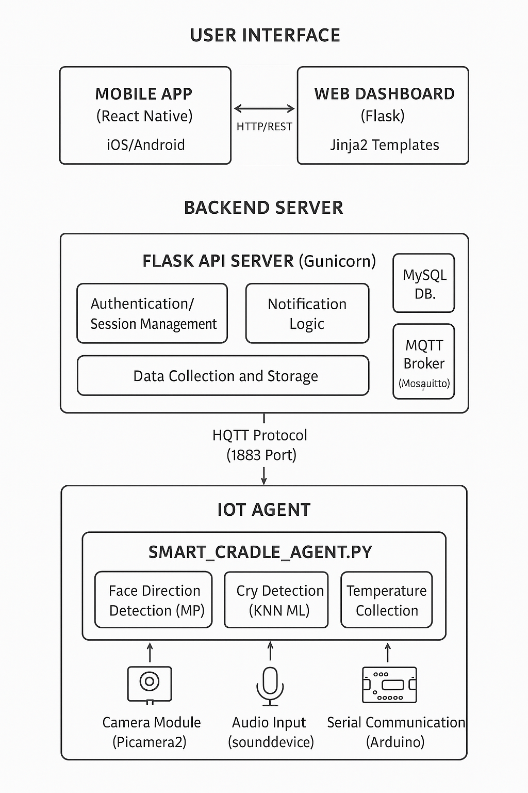
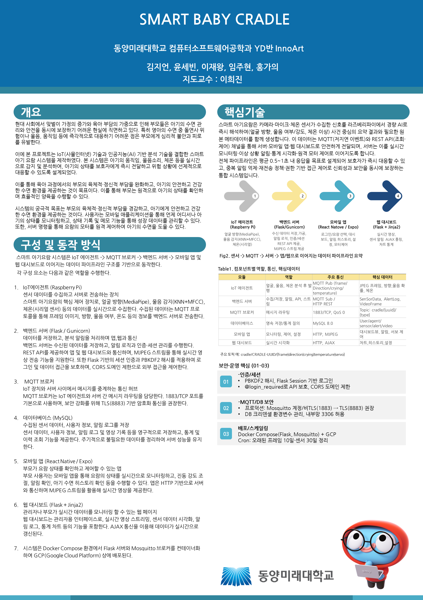

# 스마트 아기요람

## 1. 프로젝트 개요

### 1-2. 주제 선정 배경과 목표
- [분리수면 관련 유튜브](https://youtu.be/g_63LJGW7_c?si=FR7lXDaP0scf7UYZ)
- [분리수면 관련 논문 정리 블로그](https://cryycrypto.tistory.com/m/67?category=1121145)
 

## 2. 프로젝트 소개

### 2-1. 주요 기능
- 실시간 모니터링
- 요람 흔들기
- 아기 체온 측정
- 아기 움직임 감지
- 자장가, 백색소음 재생
- 아기 울음 감지

## 2-2. 현재 있는 제품과 차이점

  
### 2-3. 프로젝트 일정
2025년 3월 ~ 2025년 12월  

### UI

## 멤버 소개
||||||
|:----:|:----:|:----:|:----:|:----:|
| [홍가의](https://github.com/) | [윤세빈](https://github.com/) | [임주현](https://github.com/) | [이재왕](https://github.com/) | [김지언](https://github.com/) |
| IoT | IoT | Back-End | Front-End | Front-End |

## 개발 환경
- **Front-end**:  

- **Back-end**:  

- **Database**: 

- **협업 툴**:   
- **디자인**: 

## 프로젝트
시스템 구성도

프로젝트 계획서

[프로젝트 계획서 ppt](https://raw.githubusercontent.com/DMU-6team/6team/main/스마트아기요람계획서.pptx)

프로젝트 최종발표

[프로젝트 최종발표 ppt](https://raw.githubusercontent.com/DMU-6team/6team/main/스마트아기요람최종발표.pdf)

시연 영상

[시연 영상](https://raw.githubusercontent.com/DMU-6team/6team/main/시연영상.mp4)

## 프로젝트를 하면서 느낀점
### 김지언
프로젝트를하는과정에서오류가발생하거나모르는부분이생겼을때팀원들다같이이문제에대해어떻게해결해야하고왜오류가
나는지를서로대화하고각자의방법으로알아보고그문제에대해다시서로대화를해볼때얻게되는것들이많았고그뒤에또비슷한
오류가발생했을때금방해결할수있는모습을통해이문제에대해완전히이해하고배웠다고느낄수있었다.
1학기도잘마무리한거같고2학기에도더욱퀄리티를높이는작업들을통해잘마무리하고싶다는생각이들었다.

### 윤세빈
AI와하드웨어의잦은고장으로인해많은시간을투자하였고오류를고치는과정에서체력적으로힘들었지만결론적으론작동이
잘되어큰성취감을느꼈다. 다음학기엔더정교한AI학습을위해 많은공부를해야겠다고생각을했다.

### 홍가의
하드웨어에서한계를많이느꼈고, 기능끼리의연결이복잡했지만전체적인구조를생각하는방법을배울수있어도움이되었다.

### 임주현
클라이언트-에이전트-서버시스템을구축하며각계층의역할과중요성을깊이이해할수있었던점이보람찼다.

### 이재왕
IoT 시스템의전체구조와흐름에대한이해도를높일수있었습니다. 또한, 팀원들과의협업과정에서기획, 개발, 테스트, 
유지보수의중요성을체감하며개발프로젝트의과정을경험할수있었습니다.

## Poster

